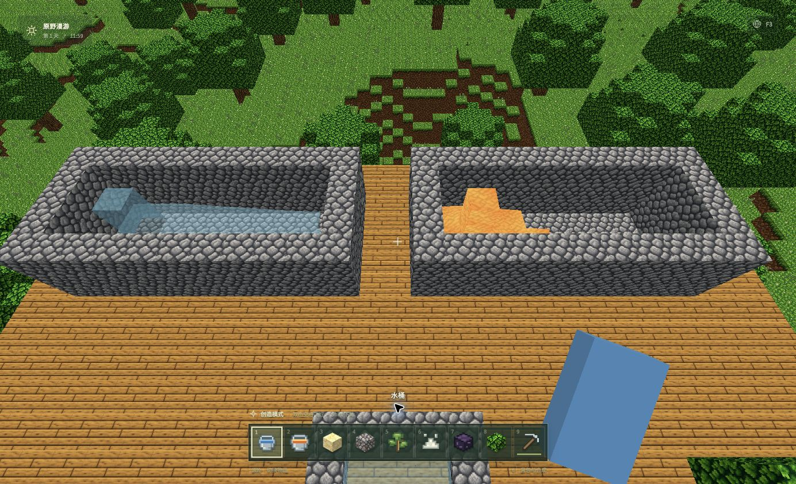
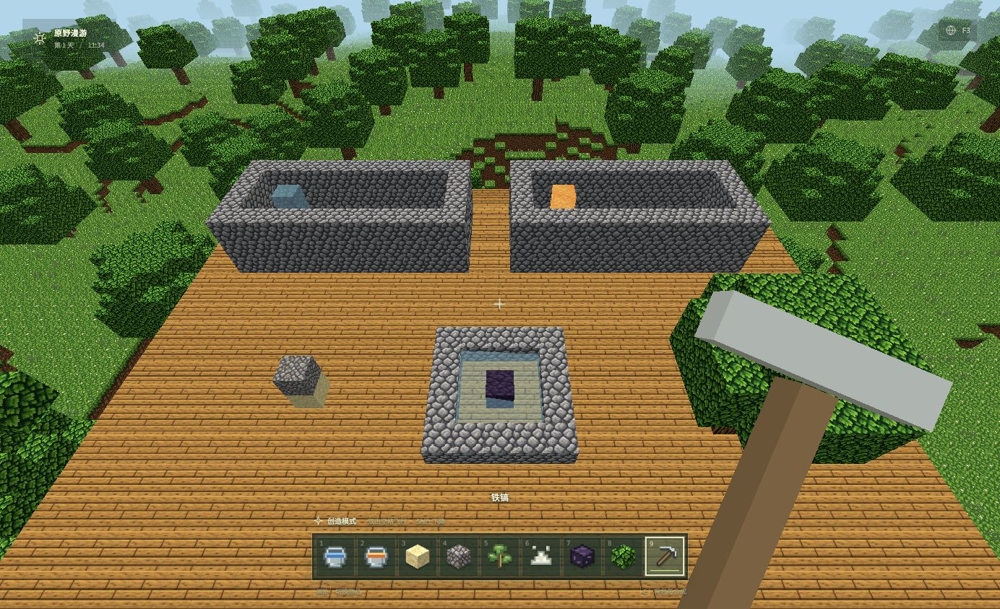
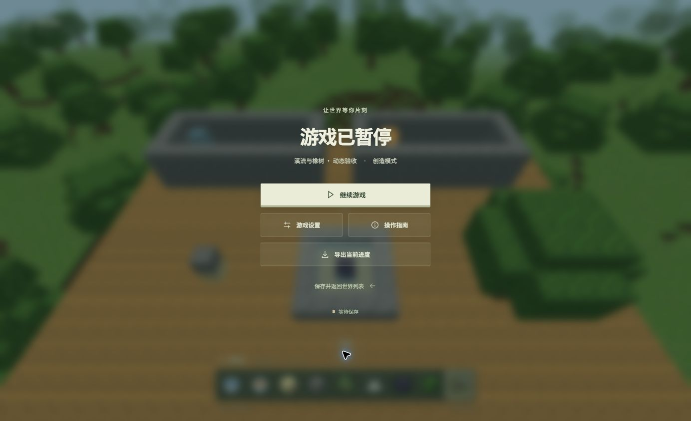

# M2 自然更新：开发与验收说明

> 本文保留自然更新增量交付时的版本 3 与 406 项测试记录。当前写入版本已升级为 4，新建世界使用生成器 4，并已接入钻石工具与黑曜石采集；后续变更及其独立证据见 [矿物与装备说明](MINERALS.md)。下文历史数字不作为新版测试结果。

日期：2026-09-05。本文记录动态流体、下落方块和橡树自然更新的当前实现，不表示 Minecraft Java 1.21.1 全功能对齐。本轮已完成下述 Chrome 开发版集成验收；其余浏览器、完整自然生存流程和持续探索性能仍待验证。

## 已实现内容与边界

| 内容 | 当前行为 |
| --- | --- |
| 水流 | 优先向下形成下落水；下方有支撑后，水平水量逐格衰减，最远 7 格。撤去唯一来源后，无其他供水的流动水逐步退去。两个相邻水源可在中间再生水源，但下方需要被当前规则视为支撑的方块或另一个水源；再生出的水源独立存在。 |
| 熔岩 | 向下优先，水平流动最多 3 格，对应水量等级 2／4／6；更新间隔比水慢。两股熔岩不会再生第三个源，撤源后无供给的熔岩流会退去。 |
| 水与熔岩接触 | 水从侧面或上方接触熔岩源，熔岩变为黑曜石；接触流动／下落熔岩则变为圆石。熔岩从上方遇水时，下方水格变为石头。桶直接放入另一类流体的即时转化也已接入。 |
| 桶与熔炼 | 空桶只回收水源或熔岩源，不回收流动状态。放置／回收先检查真实方块写入成功，再变更桶中内容。熔岩桶可提供 **1,000 个模拟秒**的熔炉燃料，点燃时在燃料槽留下空桶；熔炼每件物品仍需 10 个模拟秒。 |
| 流体接触 | 水面高度参与游泳、氧气与溺水检测；熔岩中移动较慢，玩家和生物受到接触伤害。进入熔岩的掉落物会被删除。创造模式保留其现有免伤行为。 |
| 沙子与沙砾 | 失去完整支撑后，按调度逐格下落，可替换水／熔岩。落在完整方块上重新成为地形；遇到台阶、床、耕地、植物等不适合完整体素落位的支撑时，保留支撑物并生成一个沙子／沙砾掉落物。当前呈现的是**逐格方块位移，没有平滑下落实体动画**。 |
| 原生树叶 | 与原木之间存在不超过 6 步的连续树叶连接时保留；失去连接后参与随机衰减，成功移除后可能掉落树苗、木棍或苹果。潜在支撑路径经过未加载列时暂缓判断。 |
| 永久树叶 | 玩家放置的树叶使用独立状态，不参加自然衰减；仍可被正常破坏，也可作为原生叶连接路径的一部分。 |
| 橡树苗 | 可种在草方块或泥土上，随机更新时尝试长成固定的小橡树。生长前检查地面、整个树冠范围的加载状态、世界高度、空间及光照。失去合适地面后变为树苗掉落物。 |
| 树苗骨粉 | 通过与自然生长相同的光照／空间检查后长树，并消耗一份骨粉；遮光、空间不足或地形未加载时不消耗。该规则描述的是树苗，不能据此推断所有作物拥有完全相同的骨粉条件。 |

原生叶与永久叶、固定树形以及随机生长／衰减时序是当前项目的规则实现。树苗生长会检查完整树冠所需格子，现有树叶也不能被树冠直接覆盖；这比完整 Java 版的树形及空间规则简单。

下列内容**尚未实现或尚未完整对齐**：流体对玩家／生物／物品的推力、水浸方块、熔岩引燃周边方块、离开熔岩后的持续燃烧，以及完整 Minecraft 流体几何与交互规则。现有表面高度、斜面、下落状态和接触检测不代表所有原版边缘情况均已覆盖。下落沙砾也没有独立下落实体的平滑运动和砸伤逻辑。

黑曜石可以通过流体接触生成，能在创造模式使用；其采集要求高于现有铁镐。该增量交付时尚没有钻石采集与工具成长链，因此当时不能把“生成黑曜石”表述为已完成黑曜石生存采集链或传送门进程。

## 地形与保存兼容

自然更新增量交付时，新建世界使用**生成器 3**。满足现有洞穴判定、且 `y <= -5` 的深层洞穴空间生成熔岩源；不是把整个低层地形统一填成熔岩。生成器 1／2 的采样结果保持各自版本，**旧世界不会因保存格式升级而新增天然熔岩**。旧世界仍可运行自然更新规则，但自然熔岩来源需要区分保存版本与生成器版本。

`Simulation.snapshot()` 输出 `manifest.version = 3`，同时保留原来的 `generatorVersion`。保存包含修改方块、已有玩家／物品／容器／农牧状态，以及新增的流体任务和自然更新状态：

- `fluids` 保存模拟时钟、近场扫描位置和按顺序去重的待处理任务；每项包含整数方块坐标、流体种类与到期时间。任务可以指向等待接收流体的空气格，不要求全部对应已存在的流体方块。
- `natural` 保存随机状态、累计时间、扫描位置、更新队列和暂存的下落方块。普通下落仍由世界体素表示；只有原格已移除、目标写入尚未成功的方块进入暂存记录，避免同一方块同时拥有两份状态。
- 两个服务内部的状态格式版本当前均为 `1`，与世界保存格式 `3` 是不同的版本字段。导入会检查已知字段、有限数值、世界高度、队列上限和重复记录。
- 在该增量中，读取旧存档后产生版本 3 检查点，首次写入升级检查点时，同一 IndexedDB 事务保留升级前的完整版本备份。版本 1／2 的备份可以分别保留；后续保存不覆盖对应的原始备份。

规则只在模拟调用 `step` 时推进。暂停或单机模拟停止后不按真实墙钟补算离线流动、生长或衰减；未加载或超出本地活动范围的任务保留待后续处理。保存／恢复保留调度及随机状态，不通过重新创建来源方块“恢复”流体。

## 有界更新方式

实现入口为 [`FluidSystem`](../src/game/fluids.ts) 和 [`NaturalUpdatesSystem`](../src/game/natural-updates.ts)，由 [`Simulation`](../src/game/Simulation.ts) 的成功方块写入通知相邻规则。流体冲掉作物／小型附着物时，由模拟层处理对应掉落；两个服务自身不拥有背包。

| 服务 | 队列与每次处理边界 |
| --- | --- |
| 流体 | 最多 8,192 条任务，以坐标与流体种类去重；每次 `step` 最多检查 128 条、执行 64 条，并扫描近场 32 格。扫描窗口为 17 × 17 × 9；活动范围限制在玩家附近。水任务间隔 0.25 秒，熔岩 1.5 秒，属于本项目的近似时序。 |
| 自然更新 | 更新位置最多 4,096 条，暂存下落方块最多 128 个；每个 0.1 秒调度点扫描近场 64 格，最多处理 16 个普通候选和 16 个暂存下落方块。扫描窗口为 25³，活动范围为玩家各轴附近 48 格。 |

区块未加载时不越界读取／修改。世界外上方按已知空气、下方按边界处理，世界顶端的合法流体不会因为等待高度 96 的区块而永久停住。队列上限限制单步工作和内存，不等同于大型海洋、持续探索或高密度农场已经达到性能目标。

## 当前验证记录

2026-09-05 10:04 完成全套 `pnpm test`：**406 项通过，1 项可选 CPU 基准跳过**；`pnpm build`（含 TypeScript）通过。生产主包 896.14 KB／gzip 250.85 KB，仍有超过 500 KB 的构建提示。`node scripts/check-pwa-build.mjs` 通过，12 个唯一预缓存资源、5,329,073 字节，含新地形 Worker 与两张图集。

本模块有已捕获的独立运行记录：2026-09-05 09:55，`pnpm exec vitest run tests/fluids.test.ts` **38 项通过**；对应时点的 `pnpm exec tsc --noEmit` 通过。流体测试覆盖水平距离、向下优先、撤源、双水源、混合转化、负坐标、加载边界、高度边界、自然水唤醒、队列去重与上限、写入拒绝、暂停和恢复后的结果一致性。

相关回归入口：

- [`tests/fluids.test.ts`](../tests/fluids.test.ts)：流体纯规则。
- [`tests/natural-updates.test.ts`](../tests/natural-updates.test.ts)：下落方块归属与拒绝写入恢复、树叶支撑、树苗空间／光照、随机状态和队列边界。
- [`tests/natural-integration.test.ts`](../tests/natural-integration.test.ts)：实际模拟命令、熔岩与燃料、保存升级等集成规则。
- [`tests/natural-visuals.test.ts`](../tests/natural-visuals.test.ts)：流体及自然方块的几何／选取模型；几何测试不能代替真实浏览器截图。

### 浏览器证据

真实记录：[browser-natural.json](browser-natural.json)，脚本：[browser-natural.mjs](../scripts/browser-natural.mjs)。Chrome 的 Vite 开发版，新建独立创造世界“溪流与橡树 · 动态验收”，种子 `M2-natural-20260905`。本次创建及规则动作通过本地开发接口执行，不作为纯鼠标键盘生存流程的证明。

| 项目 | 证据与结论 |
| --- | --- |
| 传播、退水、混合与重力 | 7 阶段通过：预检、水／熔岩传播、撤源退水、黑曜石生成、沙砾落位、长树与原生／永久叶区分、暂停冻结。传播时记录 27 个水格、15 个熔岩格。 |
| 保存和页面重载 | 传播中、稳定后及展示夹具 3 次真实 IndexedDB 保存回读完全一致；随后实际刷新页面并从列表继续，方块修改、流体任务、自然更新与背包逐项一致。 |
| 旧档升级 | 独立复制既有 v2 农庄展示夹具，经真实 Game 保存升为 v3；生成器保持 2，方块修改与背包一致，v2 原始备份完全相同，见原始记录 migration 字段。v1 与 v2 多版本备份共存另有自动化测试。 |
| 测试夹具 | 显式给予创造模式、y=40 高台与水槽、源水／熔岩、沙砾、泥土／树苗；直接设置玩家站位，调用规则推进。展示快捷栏额外给予桶、骨粉、方块与铁镐。这些物品不是新生存世界的初始物品。 |
| 计时与性能边界 | 60 Hz 固定步累计 41.5 模拟秒；脚本墙钟约 2.458 秒。它验证规则和检查点，不是 FPS 测试。截图视口 1384×844、DPR 2；未重跑 15 分钟性能目标。 |
| 输入回归 | 原生点击“进入世界”后 fullscreen=true、pointerLock=true、paused=false；原生 Esc 后 fullscreen=false、pointerLock=false、paused=true。 |
| 其余验证 | 熔岩伤害、物品烧毁、熔岩燃料归还桶、边界取水、树苗拒绝放置与不复制等由当前自动化测试覆盖；不能据此声称这些动作全部已做浏览器手动验收。Safari／Edge 本轮未测。 |

首次运行保留了[失败记录](browser-natural-initial-failure.json)：当时热更新前的旧 Simulation 实例在长树时额外掉出树苗。源码修复与回归测试完成后，刷新页面创建全新实例，完整流程通过；首次失败不计入通过结果。

[展示存档](examples/natural-world.voxel.json)可通过“导入世界”创建独立示例。截图由真实渲染器生成；近景另调整了相机站位，没有修改流体地形：

## 后续覆盖表验收门槛建议

以下建议只用于后续添加自然更新验收项，本文不修改其他覆盖表，也不把相关大类自动标为完成。

| 验收门槛 | 最低可复核证据 |
| --- | --- |
| 流动与撤源 | 真实世界中从桶放置源，确认水 7 格／熔岩 3 格、向下优先；在流动中保存、重进、撤源，比较实际方块和来源数量。 |
| 流体接触与桶守恒 | 分别验证水接触熔岩源／流和熔岩向下遇水；回收只作用于源，失败写入不改变桶数量；熔岩燃料点燃后留下一个空桶，保存恢复不复制燃料。 |
| 下落方块守恒 | 沙子与沙砾堆叠、负坐标、水中下落、部分支撑及目标写入失败场景中，世界方块＋暂存记录＋掉落物数量一致；验收明确接受当前逐格呈现。 |
| 叶片与树苗 | 断开原木支撑后原生叶衰减，玩家叶保留；树苗在正常光照／空间下成功，在遮光、冠幅受阻、跨未加载列时拒绝且不扣骨粉；保存恢复后无重复木材或掉落。 |
| 保存迁移与生成器 | 版本 1／2 → 3 后旧生成器不变，原始备份可恢复；新生成器深洞熔岩有明确样本。对队列、暂存下落方块和中途转化执行检查点比较及故障回滚测试。 |
| 视觉、输入与持续运行 | 实际浏览器验证流面、下落状态、选取目标、桶操作和暂停；另做与目标硬件／视距一致的持续探索基准，记录帧时间及队列／几何资源边界。缺少的推力、水浸与燃烧传播仍单列为未实现。 |

规则背景参考：[Minecraft 官方黑曜石介绍](https://www.minecraft.net/en-us/article/block-week-obsidian)、[官方熔岩介绍](https://www.minecraft.net/en-us/article/block-week-lava)。这里的传播调度与保存结构是本项目独立实现，不把这些背景文章当作 Java 1.21.1 全部规则的验收证明。
